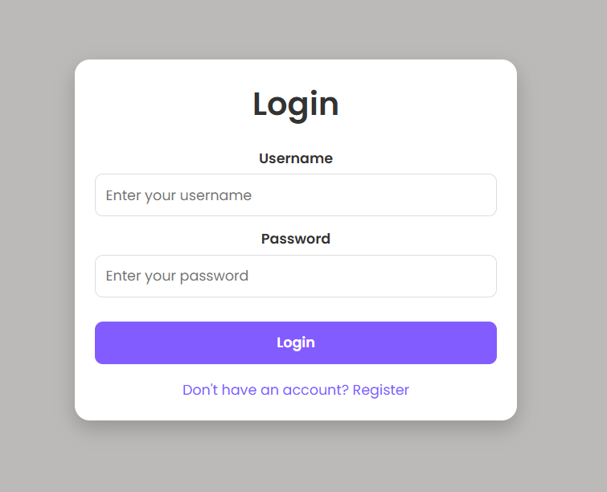
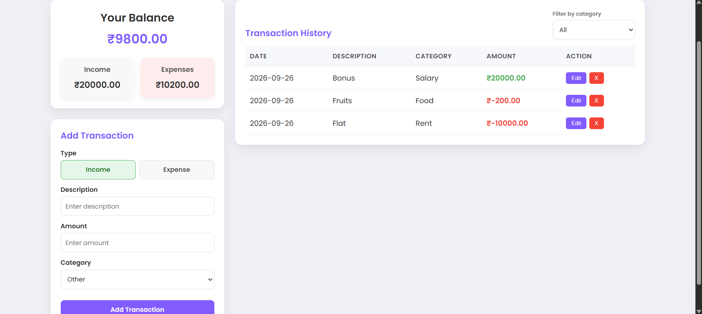

# Expense Tracker App 💰

[](https://www.java.com/)
[](https://spring.io/projects/spring-boot)
[](https://www.mysql.com/)
[](#)

A **full-stack Expense Tracker application** built with **Spring Boot**, **MySQL**, and **JavaScript**.
Users can register, log in, add/edit/delete transactions by category, and view a dynamic balance, income, and expense report.

---

## Application Preview

### Login Page


### Registration Page


### Expense Dashboard


---

## Features

### User
- Register and log in
- Add income and expense transactions, selected via an Income/Expense toggle
- Categorize transactions (Salary, Food, Rent, Entertainment, Other)
- Filter transaction history by category
- Edit an existing transaction
- Delete individual transactions (with a confirmation prompt)
- See balance, income, and expense totals calculated by the backend
- Friendly empty-state message when no transactions exist yet

### Backend
- RESTful APIs for user authentication and transaction management (7 endpoints)
- Layered architecture: Controller → Service → Repository → Database
- DTOs (Data Transfer Objects) separate the API contract from the database entities — internal fields like the hashed password are never exposed in API responses
- Passwords hashed with **BCrypt** before storage — never stored or compared in plain text
- Balance, income, and expense totals calculated **server-side** via a dedicated summary endpoint, rather than in the browser
- Centralized error handling via `@ControllerAdvice`, returning clean, consistent JSON error responses
- Basic input validation on registration and transaction creation
- MySQL database integration via Spring Data JPA / Hibernate
- Tables (`users`, `transaction`) auto-created and updated via `spring.jpa.hibernate.ddl-auto=update`

### Frontend
- Static HTML pages with CSS styling and vanilla JavaScript (no framework)
- Two-column dashboard layout (summary + form on the left, transaction history on the right)
- Forms for login, registration, and adding/editing transactions
- Session persistence via browser `localStorage`

---

## Tech Stack

| Layer | Technology |
|---|---|
| Backend | Java 17+, Spring Boot 3.5.x, Spring Data JPA, Spring Security Crypto (BCrypt) |
| Frontend | HTML, CSS, JavaScript (vanilla) |
| Database | MySQL |
| DB Client | **DBeaver** (used for creating and inspecting the database) |
| Build Tool | Maven |
| IDE | IntelliJ IDEA (backend), VS Code or IntelliJ (frontend) |

---

## Prerequisites

Before installing, make sure you have:

- **JDK 17 or newer** — check with `java --version`
- **Maven** — check with `mvn -version` (or use the IntelliJ-managed Maven if you don't install it separately)
- **MySQL Server** installed and running locally
- **DBeaver** — [download here](https://dbeaver.io/download/) — used to create and view the database
- **Git**

---

## Installation

### 1. Clone the repository
```bash
git clone https://github.com/Jiya022/expense-tracker.git
cd expense-tracker/Expense-Tracker
```

### 2. Create the database using DBeaver
1. Open DBeaver → **Database → New Database Connection** → choose **MySQL**.
2. Set Host: `localhost`, Port: `3306`, Username: `root`, Password: *(your MySQL password)*.
3. Click **Test Connection** (let DBeaver download the MySQL driver if prompted), then **Finish**.
4. Open a SQL editor on the new connection and run:
```sql
CREATE DATABASE expense_tracker;
```
You don't need to create tables manually — Hibernate creates `users` and `transaction` automatically the first time the backend runs successfully.

### 3. Configure the backend
Create a file at `src/main/resources/application.properties` (this file is intentionally excluded from git via `.gitignore` since it holds credentials):

```properties
spring.datasource.url=jdbc:mysql://localhost:3306/expense_tracker
spring.datasource.username=root
spring.datasource.password=your_mysql_password
spring.datasource.driver-class-name=com.mysql.cj.jdbc.Driver

spring.jpa.hibernate.ddl-auto=update
spring.jpa.show-sql=true
```

### 4. Run the backend
Open the project in IntelliJ IDEA and run `ExpenseTrackerApplication.java`, **or** from the terminal:
```bash
mvn clean install
mvn spring-boot:run
```
The server starts on **http://localhost:8080**.

### 5. Verify the tables in DBeaver
Refresh the `expense_tracker` database in DBeaver — you should now see the `users` and `transaction` tables, auto-created with the correct columns (including `category`) and a foreign key linking them.

### 6. Run the frontend
Open `Expense-Tracker-Frontend/register.html` directly in a browser, or serve the folder for a smoother experience:
```bash
cd Expense-Tracker-Frontend
npx serve .
```
Register a user, log in, and start adding transactions.

---

## Project Structure

```
Expense-Tracker/
├── pom.xml
├── src/main/java/.../Tracker/
│   ├── dto/             # Request/response DTOs (API contract, separate from entities)
│   ├── exception/       # Global exception handler
│   ├── model/           # User, Transaction entity classes
│   ├── repository/      # Spring Data JPA repositories
│   ├── service/         # Business logic (interface + implementation for each)
│   ├── controller/      # REST API endpoints
│   └── ExpenseTrackerApplication.java
├── src/main/resources/
│   └── application.properties   # not committed — create this yourself
├── Screenshots/
│   ├── login.png
│   ├── register.png
│   └── dashboard.png
└── Expense-Tracker-Frontend/
    ├── login.html
    ├── register.html
    ├── expense_tracker.html
    ├── script.js
    └── styles.css
```

---

## API Endpoints

| Method | Endpoint | Description |
|---|---|---|
| POST | `/ExpTrack/register` | Register a new user (password is hashed with BCrypt before storage) |
| POST | `/ExpTrack/login` | Log in with username + password |
| GET | `/ExpTrack/transactions/{username}` | Get all transactions for a user |
| GET | `/ExpTrack/transactions/{username}/category/{category}` | Get a user's transactions filtered by category |
| GET | `/ExpTrack/transactions/{username}/summary` | Get calculated balance, income, and expense totals for a user |
| POST | `/ExpTrack/transactions/{username}` | Add a transaction for a user |
| PUT | `/ExpTrack/transactions/{username}/{id}` | Update an existing transaction |
| DELETE | `/ExpTrack/transactions/{username}/{id}` | Delete a specific transaction |

---

## Known Limitations

- No token-based authentication (e.g. JWT); the frontend stores the username in `localStorage` and the backend trusts it as-is. This is a deliberate scope decision for now — the fix would be issuing a signed JWT on login and validating it server-side on every request, rather than trusting a client-supplied username.
- No pagination on transaction history — all transactions load at once.
- No automated unit tests beyond the default Spring Boot application context test.

---

## Possible Future Improvements

- JWT-based authentication, replacing the current username-trust model
- Pagination on transaction history for large datasets
- Unit tests for the service layer (JUnit + Mockito)
- Structured logging (SLF4J) across the service layer